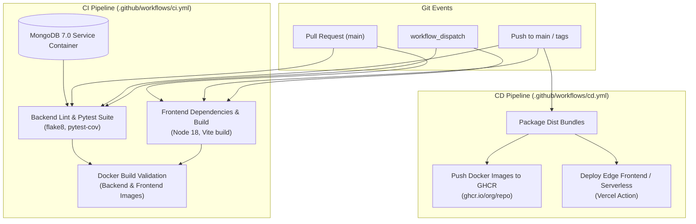

# 🚀 CI/CD Pipeline & Automated Testing Architecture

This repository is equipped with a production-grade **Continuous Integration & Continuous Deployment (CI/CD)** pipeline powered by **GitHub Actions**, containerized with **Docker & Docker Compose**, and backed by comprehensive automated test coverage for all application modules.

---

## 🛠️ CI/CD Architecture Overview



---

## 📁 Test Suite Structure & Purpose Mapping

Each module of the main application has a dedicated, isolated test file located in [`backend/tests/`](file:///h:/Time_Table_Scheduler/backend/tests/):

| Test File | Target Application Purpose | Key Behaviors Verified |
| :--- | :--- | :--- |
| [`test_main_app.py`](file:///h:/Time_Table_Scheduler/backend/tests/test_main_app.py) | `app/main.py` | API root route, health check probe, security headers (HSTS, CSP, X-Frame-Options, X-Content-Type-Options, Referrer-Policy), CORS policy, Mongo credential masking (`_mask_mongo_url`), and async lifespan startup/shutdown. |
| [`test_auth.py`](file:///h:/Time_Table_Scheduler/backend/tests/test_auth.py) | `app/api/endpoints/auth.py`<br>`app/core/security.py` | Password hashing (bcrypt) and validation, JWT creation/decoding, user registration with tenant DB naming, duplicate prevention, login authentication, `/me` profile retrieval, faculty CRUD, and role-based permissions (`get_admin_user`). |
| [`test_config.py`](file:///h:/Time_Table_Scheduler/backend/tests/test_config.py) | `app/core/config.py`<br>`app/core/logging_config.py` | Pydantic settings parsing, comma-separated allowed origins list trimming, Atlas vs local MongoDB fallback URL selection, AI keys priority (Qwen > DashScope > OpenAI), and Loguru logging setup. |
| [`test_database.py`](file:///h:/Time_Table_Scheduler/backend/tests/test_database.py) | `app/database/database.py` | Connection pooling and retry logic, unique index initialization across users, departments, subjects, faculty, and sessions, multi-tenant DB collection schema instantiation, and clean connection termination. |
| [`test_models_and_schemas.py`](file:///h:/Time_Table_Scheduler/backend/tests/test_models_and_schemas.py) | `app/models/`<br>`app/schemas/` | Pydantic schema validation for Batch, Class, Department, Faculty, Room, Subject, Timetable, User, Token, and MongoDB document helper transformations (`user_helper`, `room_helper`, etc.). |
| [`test_timetable_api.py`](file:///h:/Time_Table_Scheduler/backend/tests/test_timetable_api.py) | `app/api/endpoints/timetable.py` | CRUD operations for Batches, Departments, Classrooms, Classes, Subjects, Faculty; subject-faculty mappings; ObjectId validation; AI constraint context generation. |
| [`test_scheduler_engine.py`](file:///h:/Time_Table_Scheduler/backend/tests/test_scheduler_engine.py) | `app/services/scheduler.py` | Google OR-Tools CP-SAT constraint satisfaction engine, credit hours to contact periods conversion, internal `_Obj` document wrapper, conflict prevention modeling, and empty database safety handling. |
| [`test_ai_parser.py`](file:///h:/Time_Table_Scheduler/backend/tests/test_ai_parser.py) | `app/services/ai_parser.py` | Natural language constraint parser, enumeration of all 10 supported constraint types, weekday and number word normalization, fuzzy faculty/subject matching, and rule-based constraint fallback. |
| [`test_csv_imports.py`](file:///h:/Time_Table_Scheduler/backend/tests/test_csv_imports.py) | `app/api/endpoints/imports.py` | CSV/Excel batch imports, header column guessing and mapping, deduplication logic, and batch insertion order. |
| [`test_document_constraints.py`](file:///h:/Time_Table_Scheduler/backend/tests/test_document_constraints.py) | `app/services/document_constraints.py`<br>`app/services/document_analysis.py` | Document text extraction from PDF/DOCX/CSV, fixed timetable slot constraint translation, and normalization. |
| [`test_knowledge_ingestion.py`](file:///h:/Time_Table_Scheduler/backend/tests/test_knowledge_ingestion.py) | `app/services/ingestion/` | Multi-format ingestion pipeline, ZIP safety & traversal defense, MIME verification, fuzzy deduplicator with thresholds, learning engine alias memory, and review session audit logs. |

---

## ⚡ Running Tests Locally

### 1. Run all tests with pytest
```bash
cd backend
pytest tests/ -v
```

### 2. Run with Code Coverage
```bash
cd backend
pytest tests/ --cov=app --cov-report=term-missing --cov-report=xml
```

### 3. Run Static Code Quality Check (Flake8)
```bash
flake8 backend/app/ backend/tests/ --max-line-length=120
```

---

## 🐳 Containerized Execution (Docker Compose)

To spin up the entire application stack with a clean, isolated MongoDB instance:

```bash
docker-compose up --build -d
```

- **Frontend**: http://localhost:3002
- **Backend API Docs**: http://localhost:8000/docs
- **MongoDB**: `localhost:27017`

To shut down:
```bash
docker-compose down -v
```
